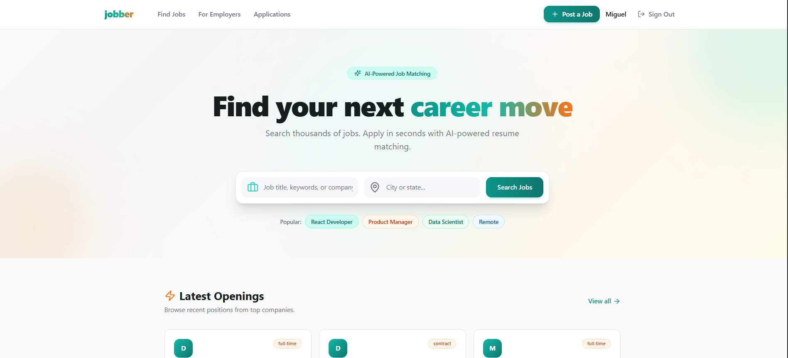

<picture>
  <source media="(prefers-color-scheme: dark)" srcset="./readme-img.png">
  
</picture>

# Jobber

AI-powered job matching platform connecting recruiters with top candidates.

## Features

- **AI Resume Parsing** — Upload PDF/DOCX, automatically extracts structured data via GPT-4o-mini
- **Smart Job Descriptions** — Generate polished job posts from a title and rough notes
- **Semantic Matching** — pgvector + OpenAI embeddings find the best candidates for each role
- **AI Candidate Scoring** — GPT-4o-mini scores each application with summary, strengths, and gaps
- **Google Auth** — Sign in with Google or email/password
- **Mexico Locations** — Autocomplete for all 2,457 municipalities
- **Observability** — OpenTelemetry traces, Prometheus metrics, Grafana dashboards

## Stack

| Layer | Technology |
|-------|-----------|
| Frontend | Next.js 15, Tailwind CSS, shadcn/ui, react-hook-form, Zod |
| Backend | FastAPI, SQLAlchemy (async), pgvector, OpenAI |
| Database | PostgreSQL 16 + pgvector |
| Auth | JWT + bcrypt / Firebase Google Auth |
| Observability | OpenTelemetry, Prometheus, Grafana, Jaeger |
| Deployment | Docker Compose / Render / Oracle Cloud |

## Quick Start (Docker)

```bash
cp .env.example .env
# Set OPENAI_API_KEY in .env
docker compose up -d --build
```

- Frontend: http://localhost:3000
- API: http://localhost:8000
- pgAdmin: http://localhost:5050 (admin@admin.com / admin)

## Deploy on Render (Free)

See [deploy/render-guide.md](deploy/render-guide.md) — 5-minute deploy with blueprint.

## Project Structure

```
├── frontend/                # Next.js 15 app
├── api-gateway/             # FastAPI gateway (routes, proxy)
├── matchmaking-service/     # Jobs, applications, matching, auth
├── ingestion-service/       # Resume processing (PDF + OpenAI)
├── docling-service/         # PDF extraction (Docling)
├── deploy/                  # Render + Oracle Cloud configs
├── monitoring/              # Prometheus, Grafana provisioning
└── proto/                   # gRPC contracts
```

## License

MIT
